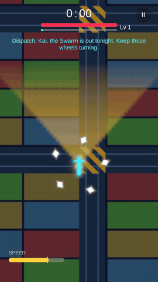
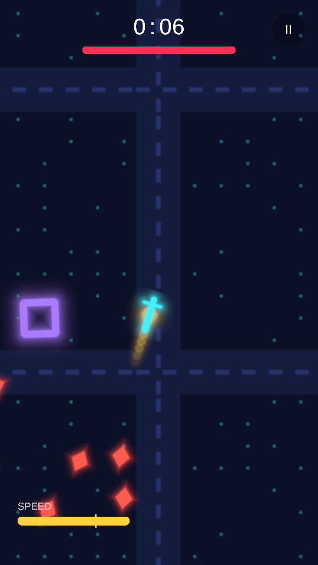
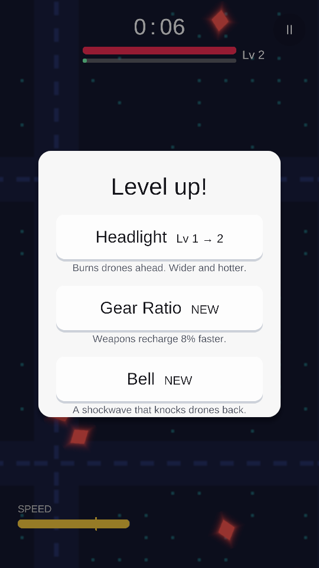

# Night Courier

*A Survivor.io-style night ride where you can't stop pedalling.* At midnight the delivery-drone network of
Neon Ward glitched, and now the Swarm chases anything that stops moving. Kai, a night-shift courier on a
fixed-gear bike, has to ride until dawn.

> **Status (Oct 2026): week 4 of 5, in progress.** A full 10-minute shift plays in Unity 6.3 LTS on map 1
> (Market Street): six weapons and six passives with four evolutions, level-up cards, a wave curve, elites to
> draft behind, Splitter and Zapper drones, scripted events at 3:00 / 6:00 / 8:30, and the Dispatcher boss at
> 10:00, whose defeat wins the shift. Between shifts, coins buy permanent upgrades in the Garage. Codex, extra
> bikes and map 2 come next. 103 EditMode tests pass, and a PlayMode smoke test plays the real game on
> autopilot: garage, ride, level-up, crash, results, a 300-drone stress ride and the boss. The screenshots below
> come from that test.

<p>
  
  
  
</p>

*The GIF and screenshots are recorded by PlayMode tests (`TrailerCapture`, `SmokeTests`). The 19-second
[trailer](docs/night-courier-trailer.mp4) comes from the same capture (`Tools/make-trailer.ps1`).*

| | |
|---|---|
| **Inspired by** | Survivor.io and Vampire Survivors (auto-attack, XP, pick 1 of 3 level-ups, weapon evolutions) |
| **Twist** | Momentum: the bike never stops. Speed raises damage and gives dodges; tight turns and braking cost speed |
| **My role** | Solo: design, code, tuning. Art and sound are generated in code for now |
| **Engine** | Unity 6.3 LTS (URP 2D), C#. Built from [unity-mobile-template](https://github.com/tranvantruongdev/unity-mobile-template) |

## How it plays (so far)

- **Drag anywhere** to steer: the joystick appears under your thumb. A light push cruises at 4 u/s, a full
  push reaches 6 u/s. Pull back to brake while the bike swings round; speed never drops below 1.5 u/s.
- Turning is rate-limited (160°/s at cruise, slower at speed), and a full-rate turn lowers your speed.
- **Speed bonus:** damage × (1 + speed/max × 0.5). Above 70% of max speed the gauge turns gold and half of
  the hits miss you.
- Scouts are fast and weak, haulers slow and heavy; from 1:30 splitters burst into two scouts, and from 2:00
  zappers hang back and fire slow magenta orbs. A hit costs HP and gives 0.5 s of invulnerability.
- Weapons fire on their own: the **Headlight** burns drones in a cone ahead, **Spoke Cards** orbit the bike,
  the **Bell** knocks back everything around, the **Chain Whip** lashes the side you turn toward, and
  **Tyre Spikes** leave a burning trail that lasts longer the faster you ride, and the **Pannier Drone** fires
  homing shots. Drones drop parcels; collect XP to level up and pick 1 of 3
  cards (items you own come up more often).
- **Drafting:** from 1:00, an elite cruises across your path every minute. Tuck in right behind it for 1.5 s
  and you get +30% speed for 2 s.

## How it's built

```
Assets/_Game/Scripts/Core/      rules in pure C# (no UnityEngine): BikeMotor, Swarm, SpatialGrid, Arsenal, Ride, RideBot
Assets/_Game/Scripts/Runtime/   Unity side: RideController, bike and swarm views, joystick, HUD, neon art
Assets/_Game/Tests/EditMode/    the same tests run in Unity and with dotnet
Assets/_Game/Tests/PlayMode/    smoke test: boot → title → autopilot ride → crash → results → 300-drone ride
Assets/_Project/                shared template: boot flow, saves, audio, haptics, UI, game feel
```

- **No physics engine for enemies.** Drones live in parallel arrays (positions, HP, kind) and move in one
  loop. Separation goes through a **spatial grid**: 2-unit cells hashed into a fixed table and
  counting-sorted, so a rebuild is O(n) with no allocation. A test checks every query against a brute-force
  scan with forced hash collisions.
- **0 B of garbage per step**, checked by a dotnet test at 100, 300 and 500 drones with the weapons firing and
  level-ups taken. Desktop: about 0.15, 0.7
  and 1.5 ms per 1/120 s simulation step. Phone numbers come from the Unity Profiler (dev builds have Stress
  100/300/500 buttons).
- **Drawing:** one pooled SpriteRenderer per alive drone, positioned in a single loop; no `Update()` per drone.
- **Deterministic:** same seed and same inputs give the same ride (within one runtime: dotnet and Unity's Mono
  round floating-point maths differently, so a seed plays out differently between them). An autopilot (steer toward the emptiest
  of 16 directions) outlives a straight ride on every tested seed, which keeps the swarm beatable.

```bash
dotnet test Tools/GameTests/NightCourier.Core.Tests.csproj   # ride rules and swarm budget, ~10 s
dotnet test Tools/CoreTests/Template.Core.Tests.csproj       # template core
```

In Unity (headless, Windows):

```bash
powershell -ExecutionPolicy Bypass -File Tools/run-unity-tests.ps1                                    # 103 EditMode tests
powershell -ExecutionPolicy Bypass -File Tools/run-unity-tests.ps1 -TestPlatform PlayMode -Graphics   # smoke test + screenshots in Logs/screenshots
```

Release setup (signing keystore, Unity login and itch.io secrets for CI) is the template's:
`Tools/setup-release-secrets.ps1`, then tag `v*`.

## Credits

Built with AI assistance (Claude Code). I designed the systems, reviewed and tested all code.
Libraries: UniTask (MIT), PrimeTween, Newtonsoft JSON (MIT). Template code: MIT (see `LICENSE`).
Font: [M PLUS Rounded 1c](https://fonts.google.com/specimen/M+PLUS+Rounded+1c) for Japanese (SIL Open Font License,
see `Assets/_Game/Fonts/OFL-MPLUSRounded1c.txt`). Texts in English, Vietnamese and Japanese (`strings.csv`).
